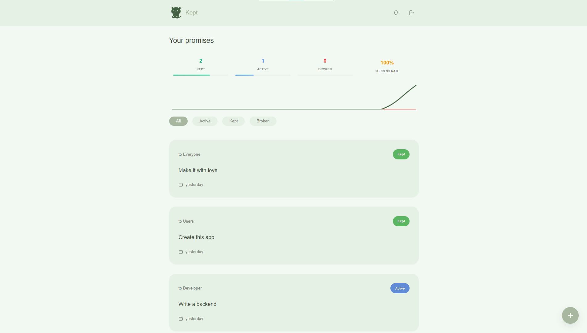

# Kept - Track what matters

**A simple, warm little app to help people keep their promises.**

**Make a promise, set reminders, and relax — Kept stores a complete timeline of events and sends friendly nudges so nothing important is lost.**

## Why I built it ❤️
I wrote this app for my girlfriend because she was always forgetting her promises, and I wanted a gentle, reliable way to remind her. I decided to open source it in case it helps anyone else who wants a friendly nudge to keep things they care about.

## Key features
- Create and manage promises
- Track your progress
- Push notifications and scheduled reminders
- Simple, clean UI for everyday use

## Get started
- If you want to try it quickly, see `DEPLOY.md` for Docker-based deployment instructions.

## Contributing & support
- Bug reports and feature requests: open an issue.
- Happy to accept PRs — small, focused changes are easiest to review.

---

If this little app helps you keep what matters, I’d love to hear about it. 🙂

— Made with love by Artur Flis

> **Disclaimer:** This app is **vibecoded**

<a href="https://github.com/panonim/kept">Kept</a> © 2026 by <a href="https://example.com">Artur Flis</a> is licensed under <a href="https://creativecommons.org/licenses/by-nc-sa/4.0/">CC BY-NC-SA 4.0</a>
